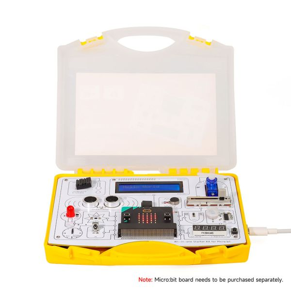

### 1, Product picture

https://www.elecrow.com/all-in-one-starter-kit-for-micro-bit-common-board-design-rich-modules-and-lessons.html

### 2, Product version number

|      | Hardware | Software | Remark |
| ---- | -------- | -------- | ------ |
| 1    | V1.0     | V1.0     | latest |

### 3, product information

- Main Processor IC: micro:bit
- Interface: Type-C Interface
- Size: 195\*170*46(mm)
- Material:PP(Non-toxic)
- Weight: 380g

|                         | [All-in-one Starter Kit for Micro:bit](https://www.elecrow.com/all-in-one-starter-kit-for-micro-bit-common-board-design-rich-modules-and-lessons.html) |
| ----------------------- | ------------------------------------------------------------ |
| Main Processor          | micro:bit                                                    |
| Number of Sensors       | 13 sensors                                                   |
| Sensor Board Design     | Integrated sensor board, no soldering or complex wiring required |
| Programming Environment | Based on micro:bit visual modular programming                |
| Number of Tutorials     | 21 creative tutorials                                        |
| Dimension               | 195x170x46mm                                                 |
| Target Audience         | Students, teachers, hardware enthusiasts                     |
| Application Scenarios   | Ideal for learning micro:bit programming basics              |

### 4,Quick Start

#### Go to the Micro:bit website:https://makecode.microbit.org/

#### Enter the online editor

### 5,Folder structure.

|--3D file： Contains 3D model files (.stp) for the hardware. These files can be used for visualization, enclosure design, or integration into CAD software.

|--Eagle_SCH&PCB: Contains **Eagle CAD** schematic (`.sch`) and PCB layout (`.brd`) files. These are used for circuit design and PCB manufacturing.

|--example: Provides example code and projects to demonstrate how to use the hardware and libraries. These examples help users get started quickly.

### 6,Pin definition

